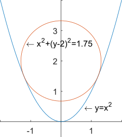

# 增广拉格朗日乘子法

&emsp;&emsp;之前的[文章](https://mp.weixin.qq.com/s?__biz=Mzg2NjY5NTE0Mw==&mid=2247483676&idx=1&sn=7ef872fc7d4106c243a54c61d6cb2138&chksm=ce47a394f9302a82d30996167721af6d18e3f13ab477355c680f728bd04e98e41a82e9b04d08&token=1050164083&lang=en_US#rd)已经介绍了拉格朗日乘子法（Lagrange Multipliers），对于一般性约束问题（包含等式约束和不等式约束）：

$$
\begin{equation}
\begin{aligned}
\mathrm{min}\ \ &f(x),\ x\in R^n \\
\mathrm{s.t.}\ \ &g(x)=c,\ c\in R^m \\
&h(x)\ge 0,\ k\in R^k
\end{aligned}
\end{equation}
$$

&emsp;&emsp;可以得到其拉格朗日函数：

$$
\begin{equation}
\begin{aligned}
L(x,\lambda)&=f(x)+\lambda_1^T\left(g(x)-c\right)+\lambda_2^T\left(h(x)-\eta\right) \\
\mathrm{s.t.}\ \ &\lambda_1\in \left\{R-\{0\}\right\}^m, \lambda_2\in {R^-}^k,\ \eta\in [0,+\infty)^k
\end{aligned}
\end{equation}
$$

&emsp;&emsp;拉格朗日乘子法通过引入拉格朗日乘子来加入一个控制项，将有约束问题转化为无约束问题。如果满足约束条件，那么这个控制项就有助于最优化，而不满足约束条件，则这个控制项就惩罚最优化。拉格朗日乘子法求解比较缓慢，且优化过程不平滑。为此，增广拉格朗日乘子法（Augmented Lagrange Multipliers）在拉格朗日函数的基础上增加了一个二次惩罚项，来平滑优化过程。

## 一、问题模型

&emsp;&emsp;本文将带约束的最优化问题分成等式约束和不等式约束两部分来考虑。

1. 等式约束

&emsp;&emsp;对于问题：

$$
\begin{equation}
\begin{aligned}
\underset{x\in R}{\mathrm{min}}\ \ &f(x) \\
\mathrm{s.t.}\ \ &g(x)=c
\end{aligned}
\end{equation}
$$

&emsp;&emsp;其中待优化的目标函数 $f:R^n\rightarrow R$；优化变量 $x\in R^n$ 和 $c\in R^m$；$s.t.$（subject to）表示服从于、约束于的意思，$g(x)=c$ 为$m$个等式约束条件。

&emsp;&emsp;定义其增广拉格朗日函数：

$$
\begin{equation}
L_a(x,\lambda)=f(x)+\lambda^T\left(g(x)-c\right) + \frac{\mu}{2}\begin{Vmatrix}g(x)-c\end{Vmatrix}_2^2
\end{equation}
$$

&emsp;&emsp;其中 $\lambda\in \left\{R-\{0\}\right\}^m$ 为拉格朗日乘子，$\mu\in R$。

&emsp;&emsp;该增广拉格朗日函数可以看作以下问题的拉格朗日函数：

$$
\begin{equation}
\begin{aligned}
\underset{x\in R}{\mathrm{min}}\ \ &f(x)+\frac{\mu}{2}\begin{Vmatrix}g(x)-c\end{Vmatrix}_2^2 \\
\mathrm{s.t.}\ \ &g(x)=c
\end{aligned}
\end{equation}
$$

&emsp;&emsp;即将二次惩罚项放到目标函数中，进而得到的新问题的拉格朗日函数与原问题的增广拉格朗日函数相同。此外，

$$
\begin{equation}
\frac{\partial{L(x,\lambda)}}{\partial{x}}=\bigtriangledown{f(x)}+\lambda^T\bigtriangledown{g(x)}
\end{equation}
$$

$$
\begin{equation}
\frac{\partial{L_a(x,\lambda)}}{\partial{x}}=\bigtriangledown{f(x)}+\lambda^T\bigtriangledown{g(x)}+\mu \left(g(x)-c\right)\bigtriangledown{g(x)}
\end{equation}
$$

&emsp;&emsp;而 $g(x)-c=0$，故 $\frac{\partial{L_a(x,\lambda)}}{\partial{x}}=\bigtriangledown{f(x)}+\lambda^T\bigtriangledown{g(x)}=\frac{\partial{L(x,\lambda)}}{\partial{x}}$，故两个问题是等价的，即它们各自的拉格朗日函数的最优值是等价的。

&emsp;&emsp;该增广拉格朗日函数可通过梯度下降法求解，为了让惩罚参数 $\mu$起作用， 令步长 $\mu$ 来加速收敛，则 $x$ 和 $\lambda$ 迭代过程如下：

$$
\begin{equation}
\begin{cases}
x^{k+1}&=\underset{x}{\mathop{\arg\min}}\ L_a(x,\lambda^k)\\&=x^k-\mu\left[\bigtriangledown{f(x^k)}+\left[\lambda^T+\mu \left(g(x^k)-c\right)\right]\bigtriangledown{g(x^k)}\right] \\
\lambda^{k+1}&=\underset{\lambda}{\mathop{\arg\min}}\ L_a(x^{k+1},\lambda)\\&=\lambda^{k}+\mu\left(g(x^{k+1})-c\right)
\end{cases}
\end{equation}
$$

2. 不等式约束

&emsp;&emsp;对于问题：

$$
\begin{equation}
\begin{aligned}
\underset{x\in R}{\mathrm{min}}\ \ &f(x) \\
\mathrm{s.t.}\ \ &g(x)\ge 0
\end{aligned}
\end{equation}
$$

&emsp;&emsp;其中待优化的目标函数 $f:R^n\rightarrow R$；优化变量 $x\in R^n$；$g(x)\ge 0$ 为$m$个等式约束条件。

&emsp;&emsp;其等价形式为：

$$
\begin{equation}
\begin{aligned}
\underset{x\in R}{\mathrm{min}}\ \ &f(x) \\
\mathrm{s.t.}\ \ &g(x)-c=0 \\
&c\ge 0
\end{aligned}
\end{equation}
$$

&emsp;&emsp;其中松弛变量 $c\in [0,+\infty)^m$ 将不等式约束经过松弛后变为等式。

&emsp;&emsp;定义其增广拉格朗日函数：

$$
\begin{equation}
\begin{aligned}
L_a(x,\lambda)&=f(x)+\lambda^T\left(g(x)-c\right) + \frac{\mu}{2}\begin{Vmatrix}g(x)-c\end{Vmatrix}_2^2\\
\mathrm{s.t.}\ \ &\lambda\le 0,\ c\ge 0
\end{aligned}
\end{equation}
$$

&emsp;&emsp;其中 $\lambda\in \left\{R-\{0\}\right\}^m$ 为拉格朗日乘子，$\mu\in R$。

&emsp;&emsp;该增广拉格朗日函数可通过梯度下降法求解，令步长为 $\mu$，则 $x$，$\lambda$ 和 $c$ 迭代过程如下：

- 固定 $\lambda$，更新 $x$ 和 $c$：

$$
\begin{equation}
\begin{aligned}
(x^{k+1}, c^{k+1})&=\underset{x,c}{\mathop{\arg\min}}\ L_a(x,c,\lambda^k)\\
&=\underset{x,c}{\mathop{\arg\min}}\ f(x)+\lambda^T\left(g(x)-c\right) + \frac{\mu}{2}\begin{Vmatrix}g(x)-c\end{Vmatrix}_2^2\\
&=\underset{x,c}{\mathop{\arg\min}}\ f(x)+\frac{\mu}{2}\left\{-\left(\frac{\lambda}{\mu}\right)^2+\begin{Vmatrix}g(x)-c+\frac{\lambda}{\mu}\end{Vmatrix}_2^2\right\}\\
&=\underset{x,c}{\mathop{\arg\min}}\ f(x)+\frac{\mu}{2}\begin{Vmatrix}g(x)-c+\frac{\lambda}{\mu}\end{Vmatrix}_2^2\\
\end{aligned}
\end{equation}
$$

- 固定 $x$ 和 $c$，更新 $\lambda$：

$$
\begin{equation}
\lambda^{k+1}=\lambda^{k}+\mu\left(g(x^{k+1})-c\right)
\end{equation}
$$

即：

$$
\begin{equation}
\begin{cases}
x^{k+1}=x^k-\mu\left[\bigtriangledown{f(x^k)}+
\begin{cases}\left[\lambda^T+\mu g(x^k)\right]\bigtriangledown{g(x^k)},\ g(x^k)+\lambda/\mu<0\\
0,\ otherwise
\end{cases}
\right] \\
c^{k+1}=\mathop{max}\left(g(x^{k+1})+\frac{\lambda^k}{\mu},\ 0\right)\\
\lambda^{k+1}=\mathop{max}\left(\lambda^k+\mu*g(x^{k+1}),\ 0\right)
\end{cases}
\end{equation}
$$

## 二、算法性质

1. 性质陈述

&emsp;&emsp;令增广拉格朗日函数的最优解为 $(x^*,\ \lambda^*)$，则

- 若 $\lambda=\lambda^*$，则 $\forall{\mu}>0,\ x^*=\underset{x}{\mathop{\arg\min}}\ L_a(x,\lambda^*)$

- 若 $\mu\rightarrow+\infty$，则 $\forall{\lambda},\ x^*=\underset{x}{\mathop{\arg\min}}\ L_a(x,\lambda)$

2. 实例验证

&emsp;&emsp;对于问题 $\mathrm{min}f(x,y)=x^2+(y-2)^2,\,\mathrm{s.t.}\ y=x^2$，其增广拉格朗日函数：

$$
\begin{equation}
\begin{aligned}
L_a(x,y,\lambda)&=f(x)+\lambda^T\left(g(x)-c\right)+\frac{\mu}{2}\begin{Vmatrix}g(x)-c\end{Vmatrix}_2^2 \\
&=x^2+(y-2)^2+\lambda(y-x^2)+\frac{\mu}{2}(y-x^2)^2
\end{aligned}
\end{equation}
$$

&emsp;&emsp;求解 $\bigtriangledown_{x,y}{L_a(x,y,\lambda)}=0$，有

$$
\begin{equation}
\begin{array}{c}
\begin{cases}
\frac{\partial{L_a(x,\lambda)}}{\partial{x}}=2x-2x\lambda+2\mu x(y-x^2)=0 \\
\frac{\partial{L_a(y,\lambda)}}{\partial{y}}=2(y-2)+\lambda+\mu(y-x^2)=0 \\
\end{cases}
\\\downarrow\\
\begin{cases}
x^2=\frac{1-\lambda}{\mu}+\frac{5-2\lambda}{2} \\
y=\frac{5-2\lambda}{2} \\
\end{cases}
or
\begin{cases}
x=0 \\
y=\frac{4-\lambda}{2+\mu} \\
\end{cases}
\end{array}
\end{equation}
$$

- 当 $\lambda\rightarrow1$ 且 $\mu>0$，有 $\left\{\begin{array}{l}x=\pm\sqrt{1.5} \\y=1.5\end{array}\right.$（性质一）
- 未知 $\lambda^*$ 且 $\mu\rightarrow+\infty$，有 $\left\{\begin{array}{l}x=0 \\y=0\end{array}\right.$（性质二）

## Reference

[1] [增广拉格朗日函数法（ALM）](https://blog.csdn.net/itnerd/article/details/86012869)  
[2] [21 有约束优化算法：增广拉格朗日法和 ADMM](https://zhuanlan.zhihu.com/p/199233872)
