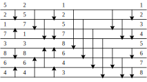
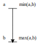
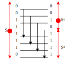
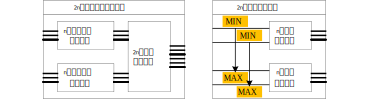
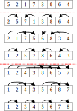

# 双调排序

&emsp;&emsp;常见的排序算法有很多，比如冒泡排序、快速排序，本文想介绍一种不常见的排序方法——双调排序（Bitonic Sort）。

## 一、介绍

&emsp;&emsp;双调序列（Bitonic Sequence）是指由一个单调递增序列 $A$ 和一个单调递减序列 $D$ 组合而成的序列 $AD$或者 $DA$。

&emsp;&emsp;排序网络（Sort Network）是一种数据独立（data-independent，即比较顺序与数据无关）的排序方法。对于任意的输入序列，排序网络能够输出其单调递增序列或者单调递减序列，特别适用于硬件并行化，在 GPU、FPGA 有广泛应用。而双调排序就是一种排序网络方法。

&nbsp;&nbsp;

图 1. (a) 比较器；(b) 半清洁器。

&emsp;&emsp;在排序网络中，有两个重要的组成部件——比较器和半清洁器，如图 1 所示。若 $a$ 和 $b$为 1 比特数（0 或 1），则 $\mathop{min} (a,b)=a\mathop{\&}b$，$\mathop{max} (a,b)=a\mathop{|}b$。从电路实现角度讲，排序网络中的水平线为导线，带箭头的垂线为逻辑单元，从而构成一个具有排序网络功能的电路。半清洁器能够将一个长度为 $2n$ 的双调序列 $S$ 变成上下两个长度为 $n$ 的的双调序列 $S_u$ 和 $S_d$，且 $\forall{x\in S_u}, x\le\mathop{min}(S_d)$（Batcher 定理）。对于比特序列，半清洁器将至少产生一个清洁序列（全 0 或者全 1），如 $S_d$。

## 二、双调排序

图 2. $2n$ 输入的升序双调排序。

&emsp;&emsp;利用分治思想，双调排序可以将长度 $2n$ 的序列划分为两个子序列，并分别对它们进行双调排序，再将排序后的单调序列进行双调合并，流程按图 2 所示。双调合并（Bitonic Merge）也是根据分治思想，将两个相邻的、单调性相反的单调序列看作一个双调序列， 然后合并排序。 这样只要每次两个相邻长度为 $n$ 的序列的单调性相反， 就可以通过连接得到一个长度为 $2n$ 的双调序列，最后对这个 $2n$ 的序列进行一次双调合并，使其变成有序.

&emsp;&emsp;对于长度为 $n$ 的序列，通过双调排序所需要的比较器级数

$$
\begin{aligned}
T(n)&=\mathop{log}(n)+T(n/2) \\
&=\mathop{log}(n)+\mathop{log}(n)-1+\mathop{log}(n)-2+...+1 \\
&=\mathop{log}(n)*\left(\mathop{log}(n)+1\right)/2
\end{aligned}
$$

&emsp;&emsp;而每一级由 $n/2$ 个比较器组成，则一共需要的比较器数量为 $\mathcal{O}\left(n*\left(\mathop{log}(n)\right)^2\right)$

## 三、实例演示

&emsp;&emsp;对于数列{5,2,1,7,3,8,6,4}，其双调排序过程如图 3 和本文封面所示。

图 3. 数列{5,2,1,7,3,8,6,4}的双调排序过程。

## Reference

[1] [Bitonic sort](https://www.inf.hs-flensburg.de/lang/algorithmen/sortieren/bitonic/bitonicen.htm)
