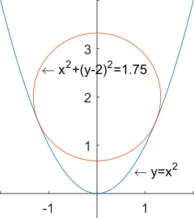

# 拉格朗日乘子法

&emsp;&emsp;拉格朗日乘子法（Lagrange multipliers）是一种寻找**多元函数**在其变量受到**一组约束**时的**极值**的方法。

&emsp;&emsp;通过引入拉格朗日乘子，又称拉格朗日乘数，该方法可以将具有$n$个变量与$m$个约束条件的最优化问题转换为具有$n+m$个变量的无约束优化问题。拉格朗日乘子法所得的极点会包含原问题的所有极值点，但并不保证每个极值点都是原问题的极值点。

## 一、问题模型

&emsp;&emsp;本文将带约束的最优化问题分成等式约束和不等式约束两部分来考虑。

1. 等式约束

&emsp;&emsp;对于问题：

$$
\begin{equation}
\begin{aligned}
\underset{x\in R}{\mathrm{min}}\ \ &f(x) \\
\mathrm{s.t.}\ \ &g(x)=c
\end{aligned}
\end{equation}
$$

&emsp;&emsp;其中待优化的目标函数 $f:R^n\rightarrow R$；优化变量 $x\in R^n$ 和 $c\in R^m$；$s.t.$（subject to）表示服从于、约束于的意思，$g(x)=c$ 为$m$个等式约束条件。

&emsp;&emsp;该问题通常可以通过**消元法**或者**拉格朗日乘子法**求解。约束条件会将解的范围限定在一个可行域内，但在可行域内不一定能够找到 $f(x)$ 的极值点，即 $\bigtriangledown{f(x)}\ne 0$，故只需要在可行域内找到 $f(x)$ 的最小值即可。本文主要讲解拉格朗日乘子法，先定义其拉格朗日函数：

$$
\begin{equation}
L(x,\lambda)=f(x)+\lambda^T\left(g(x)-c\right)
\end{equation}
$$

&emsp;&emsp;其中 $\lambda\in \left\{R-\{0\}\right\}^m$ 为拉格朗日乘子。

&emsp;&emsp;为获取可行域内 $f(x)$ 的最小值，必要条件是目标函数 $f(x)$ 的等高线与约束函数 $g(x)=c$ 相切，此时它们的法向量平行，切点的梯度共线，$\lambda$为它们梯度的长度比值。故通过 $\bigtriangledown{L(x,\lambda)}=0$，可联立方程进行求解：

$$
\begin{equation}
\begin{cases}
\frac{\partial{L}}{\partial{x}}=\bigtriangledown{f(x)}+\lambda^T\bigtriangledown{g(x)}=0 \\
\frac{\partial{L}}{\partial{\lambda}}=g(x)-c=0
\end{cases}
\end{equation}
$$

2. 不等式约束

&emsp;&emsp;对于问题：

$$
\begin{equation}
\begin{aligned}
\underset{x\in R}{\mathrm{min}}\ \ &f(x) \\
\mathrm{s.t.}\ \ &g(x)\ge 0
\end{aligned}
\end{equation}
$$

&emsp;&emsp;其中待优化的目标函数 $f:R^n\rightarrow R$；优化变量 $x\in R^n$；$g(x)\ge 0$ 为$m$个不等式约束条件。

&emsp;&emsp;其等价形式为：

$$
\begin{equation}
\begin{aligned}
\underset{x\in R}{\mathrm{min}}\ \ &f(x) \\
\mathrm{s.t.}\ \ &g(x)-c=0 \\
&c\ge 0
\end{aligned}
\end{equation}
$$

&emsp;&emsp;其中松弛变量 $c\in [0,+\infty)^m$ 将不等式约束经过松弛后变为等式。

&emsp;&emsp;为了简化条件，令 $c=\begin{vmatrix}c_1^2\\c_2^2\\...\\c_m^2\end{vmatrix}$

&emsp;&emsp;定义拉格朗日函数：

$$
\begin{equation}
\begin{aligned}
L(x,\lambda)&=f(x)+\lambda^T\left(g(x)-c\right)  \\
\mathrm{s.t.}\ \ &\lambda\le 0
\end{aligned}
\end{equation}
$$

&emsp;&emsp;由于$\bigtriangledown{L(x,y,\lambda)}=0$，而两者法向量相反，则有 $\lambda\le 0$，这是不等式约束与等式约束问题拉格朗日乘子法的一个重要区别。

&emsp;&emsp;可联立方程求解：

$$
\begin{equation}
\begin{cases}
\frac{\partial{L}}{\partial{x}}=\bigtriangledown{f(x)}+\lambda^T\bigtriangledown{g(x)}=0 \\
\frac{\partial{L}}{\partial{\lambda}}=g(x)-c=0 \\
\frac{\partial{L}}{\partial{c}}=2\lambda \begin{vmatrix}c_1\\c_2\\...\\c_m\end{vmatrix}=0 \\
\lambda\le 0
\end{cases}
\end{equation}
$$

## 二、实例求解

1. 等式约束

&emsp;&emsp;对于问题 $\mathrm{min}f(x,y)=x^2+(y-2)^2,\,\mathrm{s.t.}\ y=x^2$，引入拉格朗日乘子，可得拉格朗日函数：

$$
\begin{equation}
\begin{aligned}
L(x,y,\lambda)&=f(x)+\lambda^T\left(g(x)-c\right) \\
&=x^2+(y-2)^2+\lambda(y-x^2)
\end{aligned}
\end{equation}
$$

&emsp;&emsp;可通过 $\bigtriangledown{L(x,y,\lambda)}=0$ 来求解 $L(x,y,\lambda)$ 的极值点，即

$$
\begin{equation}
\begin{cases}
\frac{\partial{L}}{\partial{x}}=2x-2\lambda x=0 \\
\frac{\partial{L}}{\partial{y}}=2(y-2)+\lambda=0 \\
\frac{\partial{L}}{\partial{\lambda}}=y-x^2=0
\end{cases}
\rightarrow
\begin{cases}
x=\pm\sqrt{1.5} \\
y=1.5 \\
\lambda=1
\end{cases}
\end{equation}
$$

&emsp;&emsp;故 $\mathrm{min}f(x,y)=x^2+(y-2)^2$ 在极值点 $(\pm\sqrt{1.5}, 1.5)$ 取得极值 1.75。

2. 不等式约束

- 极值在不等式边界约束区域内

&emsp;&emsp;对于问题 $\mathrm{min}f(x,y)=x^2+(y-2)^2,\,\mathrm{s.t.}\ y\ge x^2$，圆点 $(0, 2)$ 在 $y\ge x^2$ 区域内，故 $\mathrm{min}f(x,y)=x^2+(y-2)^2$在极值点为 $(0, 2)$ 取得极值 0。此时为了使 $\bigtriangledown{L(x,y,\lambda)}=0$ 成立，则 $\lambda=0$。

- 极值在不等式约束边界上

&emsp;&emsp;对于问题 $\mathrm{min}f(x,y)=x^2+(y-2)^2,\,\mathrm{s.t.}\ y\le x^2$，圆点(0,2)在 $y\le x^2$ 区域外，故 $\mathrm{min}f(x,y)=x^2+(y-2)^2$ 极值在 $y=x^2$ 上，即转化为了等式约束问题 $\mathrm{min}f(x,y)=x^2+(y-2)^2,\,\mathrm{s.t.}\ y=x^2$ 来求解。

3. 总结

&emsp;&emsp;对于一般性约束问题（包含等式约束和不等式约束）：

$$
\begin{equation}
\begin{aligned}
\mathrm{min}\ \ &f(x),\ x\in R^n \\
\mathrm{s.t.}\ \ &g(x)=c,\ c\in R^m \\
&h(x)\ge 0,\ k\in R^k
\end{aligned}
\end{equation}
$$

&emsp;&emsp;可以得到其拉格朗日函数：

$$
\begin{equation}
\begin{aligned}
L(x,\lambda)&=f(x)+\lambda_1^T\left(g(x)-c\right)+\lambda_2^T\left(h(x)-\eta\right) \\
\mathrm{s.t.}\ \ &\lambda_1\in \left\{R-\{0\}\right\}^m, \lambda_2\in {R^-}^k,\ \eta\in [0,+\infty)^k
\end{aligned}
\end{equation}
$$

&emsp;&emsp;在可行域 $D=\left\{x|g(x)=0,h(x)\ge 0\right\}$ 内，目标函数 $f(x)$ 是拉格朗日函数的一个上届，即

$$
\begin{equation}
\underset{\lambda}{\mathrm{max}}\ L(x,\lambda)=\begin{cases}f(x),\ x\in D \\
+\infty,\ otherwise\end{cases}
\end{equation}
$$

&emsp;&emsp;等价于：

$$
\begin{equation}
\underset{x}{\mathrm{min}}\ f(x)=\underset{x}{\mathrm{min}}\underset{\lambda}{\mathrm{max}}\ L(x,\lambda)\\
\end{equation}
$$

&emsp;&emsp;故拉格朗日乘子法将有约束的最优化问题转换为了无约束的最优化问题，
且函数 $\underset{\lambda}{\mathrm{max}}$ 取 $+\infty$ 时 $\lambda_2$ 为 $-\infty$，优化过程非常不光滑。
