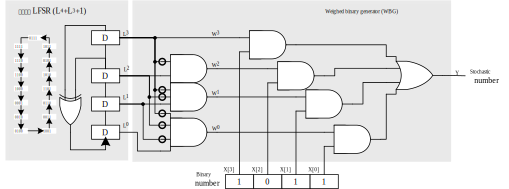

# 随机计算

&emsp;&emsp;随机计算(Stochastic Computing, SC)通过比特流（bit stream）来表示数值，而数值本身为概率值，即该比特流中每一位比特为 1 的概率。基于伯努利大数定律，频率可以用来近似概率，故该比特流中 1 个数的占比可以表示每一位比特为 1 的概率。如：$1010 \rightarrow 0.5$

## 数值的表示方法

1. Unipolar encoding（可表示 $[0, 1]$ 的数值 $y = \frac{N_1}{N}$）

$$P(X=1) = \frac{\sum_{x\in X}{x}}{\left|X\right|} = y$$

&emsp;&emsp;如 $01010100$ 可以表示 $y=P(X=1)=3/8=0.375$

2. Bipolar encoding（可表示 $[-1, 1]$ 的数值 $y = \frac{N_1 - N_0}{N}$）

$$P(X=1) = \frac{\sum_{x\in X}{x}}{\left|X\right|} = \frac{y+1}{2}$$

&emsp;&emsp;如 $01010100$ 可以表示 $y=-0.25$，即 $P(X=1)=3/8=0.375=\frac{-0.25+1}{2}$。

&emsp;&emsp;从以上两种表示法可以看出  
&emsp;&emsp;（1）对于数值 $y$，其 SC 表示方式不唯一；  
&emsp;&emsp;（2）比特流中某一位翻转后对于数值的影响较低，即 SC 具有良好的容错能力；  
&emsp;&emsp;（3）比特流的长度随 SC 计算精度增加而呈指数增长；

## 数值计算

1. 乘法

&emsp;&emsp;随机计算兴起的一个主要因素是乘法非常容易被实现。对于 Unipolar，乘法仅通过一个与门就可以实现，而对于 Bipolar，则仅需要一个 XNOR 门。

图 1. (a) Unipolar 乘法；(b) Bipolar 乘法；(c) Unipolar 乘法失效。

&emsp;&emsp;但是有时可能结果是不正确的，如图 1 (c) 所示。若要使得与门利用 SC 理论准确表示乘法运算，则需要输入的两个操作数是不相关的或者说是独立的。但是这里 $2/8$ 相比于 $3/8$，数值相差不大，进一步说明了 SC 具有良好的容错能力。此外，图 1 (b)中无论两个操作数是否相关，均无法得到准确结果，因为 $\frac{3/8+1}{2}=\frac{5.5}{8}$ 无法用 8 位比特流表示。

2. 加法

图 2. (a) 基于或门实现，误差较大且无法捕捉进位；(b) 基于多路选择器，实现简单，只需从输入中选择一个；(c) 基于 Approximate parallel counter (APC)，计数 1 的个数，然后表示成一个二进制数；(d) 基于 (b) 和 Unipolar encoding 实现加法的示例。

&emsp;&emsp;对于图 2 (d)，基于 Unipolar encoding，有 $P(Y)=P(X_3)P(X_1)+\left(1-P(X_3)\right)P(X_2)=\frac{P(X_1)+P(X_2)}{2}=5/8$。基于 Bipolar encoding，有 $y=2P(X=1)-1=2(\frac{P(X_1=1)}{2}+\frac{P(X_2=1)}{2})-1=\frac{2P(X_1=1)-1}{2}+\frac{2P(X_2=1)-1}{2}=\frac{x_1+x_2}{2}$，即若要计算 $x_1+x_2$，则从 $\left\{x_1, x_2\right\}$ 挑选一个，用其 Bipolar encoding 来表示 $\frac{x_1+x_2}{2}$。

## 数值转换

图 3. (a) 二进制数转随机数；(b) 随机数转二进制数。

1. 二进制数转随机数

&emsp;&emsp;随机数生成器（Stochastic Number Generator，SNG）包含两部分：（a）随机数产生器（Random Number Generator，RNG），用于生成 $n$ 位的二进制数，且一个周期内每一个数生成的概率为 $\frac{1}{2^n}$；（b）比较器（Comparator），用于判断随机数 $y$ 是否小于 $x$，若小于则输出 1，其概率为 $\frac{x}{2^n}$，表现为输出的长度为 $2^n$ 的二进制序列中，1 所占比例为 $\frac{x}{2^n}$。

2. 随机数转二进制数

&emsp;&emsp;在随机数转二进制数的转换电路中，SC 作为计数器（Counter）的使能信号，一个计数周期内计数的次数为比特流中 1 的个数，从而得到二进制数。

## 实例

图 4. 利用 SC 实现 $Y=X_1 X_2 X_3 + X_3(1-X_4)$。

&emsp;&emsp;图 4 利用 SNG 生成适当的 SN 来使得结果准确。但是实际中，即使高质量的 SNG 所产生的 SN，如：

$$
S_1 = 01100010, S_2 = 00111111 \\
S_3 = 11111111, S_4 = 00000000
$$

&emsp;&emsp;得到结果 $Y = 11111011 = 7/8 \neq 6/8$。下面分析一下产生偏差的原因。

1. 随机数的固有抖动

&emsp;&emsp;图 1 (b)很好地展示了随机数的固有抖动现象。在图 4 中 $S_6$ 结果准确的概率为

$$
P(S_6=\frac{6}{8})=\mathrm{C}_8^6(\frac{6}{8})^6(\frac{2}{8})^2\approx 0.31
$$

&emsp;&emsp;令 $\stackrel{-}{P}$为 $n$ 比特流真实所表示的概率值；$P$ 表示期望达到的概率值，根据 $n$ 个独立的基于伯努利分布的变量的和产生的新变量的方差为 $nP(1-P)$，得方差为

$$
D(P)=E[(P-\stackrel{-}{P})^2]=\frac{nP(1-P)}{n^2}=\frac{P(1-P)}{n}
$$

&emsp;&emsp;故 SN 所表示的概率值以 $O(\sqrt{n})$ 的速度来收敛到 $\stackrel{-}{P}$。即 SN 的精度随着比特流长度的增长而提升——$渐进精度$。如果一串长度为 $n$ 的比特流，如果这串比特流构成的所以 SN 全部相等且等于 $\stackrel{-}{P}$，即$\forall{i,j\in [1,\log_2{n}]}, P_i = P_j$——$一致精度$。

2. 输入序列之间具有相关性

&emsp;&emsp;对于输入的两个 $n$ 位的比特流 $S_1, S_2$，当且仅当 $\sum\limits_{i=1}^{n}{S_1(i)S_2(i)}=\frac{\sum\limits_{i=1}^{n}{S_1{(i)}}\times\sum\limits_{i=1}^{n}{S_2{(i)}}}{n}$ 时，$S_1, S_2$ 不相关或者独立。

&emsp;&emsp;线性反馈移位寄存器（Linear Feedback Shift Register, LFSR）可以用于产生不相关的比特流，其过程类似于 $n$ 重伯努利实验，所以最后产生的比特流中的 $1$ 和 $0$ 的个数几乎一样；而且它产生的随机数是循环周期的产生，且每个周期内产生数据的顺序是一致的且不重复，因此它可以准确地用一串序列中 1 的个数来反映每一位为 1 的概率。

图 5. 基于斐波那契 LFSR 的 SNG。

$$
W_3=L_3 \\
W_2=(1-L_3)L_2 \\
W_1=(1-L_3)(1-L_2)L_1 \\
W_0=(1-L_3)(1-L_2)(1-L_1) \\
$$

&emsp;&emsp;根据 SN 互不相关的性质可得：$P_3=\frac{1}{2}, P_2=\frac{1}{4}, P_1=\frac{1}{8}, P_0=\frac{1}{16}$，类比概率论中互不相容事件，可得 $Y\approx X$

## Reference

[1] https://blog.csdn.net/qq_34037046/article/details/83822305
[2] https://www.cnblogs.com/yihaha/p/7265282.html
