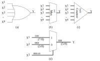

# 随机计算

随机计算(Stochastic Computing, SC)通过比特流（bit stream）来表示数值，而数值本身为概率值，即该比特流中每一位比特为 1 的概率。基于伯努利大数定律，频率可以用来近似概率，故该比特流中 1 个数的占比可以表示每一位比特为 1 的概率。如：$1010 \rightarrow 0.5$

## 数值的表示方法

1. Unipolar encoding（可表示 $[0, 1]$ 的数值 $y$）

$$P(X=1) = \frac{\sum_{x\in X}{x}}{\left|X\right|} = y$$

如 $01010100$ 可以表示 $y=P(X=1)=3/8=0.375$

2. Bipolar encoding（可表示 $[-1, 1]$ 的数值 $y$）

$$P(X=1) = \frac{\sum_{x\in X}{x}}{\left|X\right|} = \frac{y+1}{2}$$

如 $01010100$ 可以表示 $y=-0.25$，即 $P(X=1)=3/8=0.375=\frac{-0.25+1}{2}$。

从以上两种表示法可以看出
（1）对于数值 $y$，其 SC 表示方式不唯一；
（2）比特流中某一位翻转对于数值的影响较低，即 SC 具有良好的容错能力；
（3）比特流的长度随 SC 计算精度增加而呈指数增长；

## 数值计算

1. 乘法

随机计算兴起的一个主要因素是乘法非常容易被实现。对于 Unipolar，乘法仅通过一个与门就可以实现，而对于 Bipolar，则仅需要一个 XNOR 门。

图 1. (a) Unipolar 乘法；(b) Bipolar 乘法；（c）Unipolar 乘法失效。

但是有时可能结果是不正确的，如图 1 (c)所示。若要与门利用 SC 理论准确表示乘法运算，则需要输入的两个操作数是不相关的或者说是独立的。但是这里 $2/8$ 相比于 $3/8$，数值相差不大，进一步说明了 SC 具有良好的容错能力。

2. 加法

图 2. (a) 基于或门实现，误差较大且无法得到进位；(b) 基于多路选择器，实现简单但无法得到进位；（c）基于 Approximate parallel counter (APC)，计数 1 的个数，然后表示成一个二进制数；（d）基于（b）实现加法的示例。

## Reference

https://blog.csdn.net/qq_34037046/article/details/83822305
https://www.cnblogs.com/yihaha/p/7265282.html
